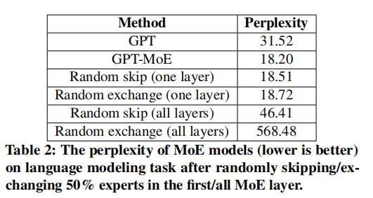

<!-- PROJECT LOGO -->
 

<h3 align="center">PC-MoE: Resource-Constrained MoE Model Serving via Dynamic Expert Orchestration</h3>
  

  

<!-- <video src="project_video.mp4" width="800px" height="600px" controls="controls"></video> -->

> 📚 **Welcomes to provide your valuable comments or suggestions by 'Issues' or my [contact information](#contact)**    
> ✨ 欢迎通过”issues“或我的[联系方式](#contact)，为我提供宝贵意见   

<!-- TABLE OF CONTENTS -->

  
Table of Contents

  <ol>
    <li>
      <a href="#overview">Overview</a>
    </li>
    <li>
      <a href="#motivation-and-background">Motivation and background</a>
    </li>
    <li><a href="#opportunity-and-challenges">Opportunity and Challenges</a>
    <li><a href="#methods">Methods</a>
    <li><a href="#evaluation">Evaluation</a>
    <ul>
        <li><a href="#tasks-and-datasets">Tasks and Datasets</a></li>
        <li><a href="#baselines">Baselines</a></li>
        <li><a href="#latency-accuracy-tradeoffs-experiment">Latency-accuracy tradeoffs experiment</a></li>
      </ul>
    </li>
    <li><a href="#contact">Contact</a></li>
  </ol>

## Overview
Large-scale models are very popular nowadays, and researchers are trying to find ways to scale up the models, as the performance often shows a positive correlation with the model size. One of the techniques is mixture of experts, which enables conditional computation so that the computational cost does not grow linearly with the model size during inference. By horizontally expanding some layers of the model into multiple modules (as shown in the figure below, the original FFN is expanded into multiple FFN experts, which are multiple experts), only the most relevant experts are activated by a gate module for each input sample during the inference process.
The MoE structure is often accompanied by the Transformer architecture, in which the input of each MoE layer is a sequence of tokens and each token may choose different experts in one MoE layer

## Motivation and background
Serving MoE models in resource-constrained latency-critical edge scenarios is challenging due to the significantly increased model size and complexity.
Large size and high complexity of MoE models limit their adoption on resource-constrained devices. However, do we need to load the entire model into the main memory when inferring a video? We can activate a certain number of experts to maintain a certain amount of computation, but is there any correlation between the frames in the video, and what is a better activation strategy to help us better manage these experts, to better reduce the inference latency and memory?

We divided our motivation study into three parts.
1. Expert activations are subject to temporal locality

The activation patterns of eight experts in an MoE layer in the Swin-MoE model. The input data is a video, and the video frames are processed continuously. Each row represents the expert activation for a frame. The color for each expert in each frame means the number of tokens that activate the expert.
This observation suggests that the expert activation patterns in the MoE model remain largely unchanged over a period.

2. Experts could be exchangeable for most input examples, though experts are trained for different functionalities.

The mAP of MoE models (higher is better) on the object detection task after randomly skipping/exchanging 50% experts in the first/all MoE layer.

3. Computation of experts is skippable, skipping the execution of some experts would lead to a little influence on the model inference result.

The perplexity of MoE models (lower is better) on language modeling task after randomly skipping/exchanging 50% experts in the first/all MoE layer.

## Opportunity and Challenges
Based on the observations, it is possible to optimize the inference process of MoE models by dynamically orchestrating the experts and using only a subset of important experts to handle the input data.
Our goal is to design such a system that can reduce the resource requirements (memory and latency) of continuous MoE model serving while retaining model accuracy by dynamically orchestrating the experts.
However, achieving this goal requires further addressing two challenges:
1. Given the large number of experts in MoE models, how to select and maintain the expert subset is non-trivial. For example, the model performance (accuracy, latency, memory consumption, etc.) is strongly correlated to the total number of important experts retained in the main memory, the distribution of important experts across different MoE layers, the update frequency of important experts, and the request handling strategy for all experts.
2. Managing the subset of experts would introduce extra costs, which may slow down the original inference process.
To keep the most important experts in use, we need to analyze the experts' importance, update the subset of important experts, and implement different request-handling strategies while serving MoE models.

## Methods

PC-MoE addresses the above problems with a two-phase design, including an offline planning phase and an online scheduling phase.
In the offline phase, we introduce a committee planner to solve first challenge, which can find the optimal configuration of Parameter committee. Based on profiling data collected with various configurations, we model the mapping relation between the configurations and MoE performance, which helps to efficiently find the configuration that can meet the memory and latency constraints while maximizing the model accuracy.
In the online phase, we introduce a committee scheduler to solve second challenge, which can dynamically swap the experts and handle expert computation requests. Specifically, we estimate the importance of each expert based on its input and weight magnitudes. High-importance experts are periodically and asynchronously swapped into the memory in a layer-wise manner to reduce overhead.
The offline phase and the online phase are correlated --- the planner determines the configuration according to the performance of the committee scheduler which serves the model with the planner-defined configuration.
More details please see in the chapter 4 and 5 in paper

## Evaluation
We use two devices including an edge server with an NVIDIA 3090 GPU (used for most experiments unless otherwise explained) and a Jetson AGX ORIN with 64GB unified memory.
For the language modeling task, we use an A100 GPU with 80GB GPU memory for experiments.
The batch sizes are all set to 1 as in common edge-side continuous serving scenarios.
We use different latency and memory budgets to simulate different hardware constraints.

### Tasks and Datasets
We evaluate the performance of PC-MoE on three common DL tasks.
1. __Object detection__ aims to detect objects in an image, predicting the object bounding boxes and categories. We chose Cascade with Swin-MoE base backbone as the detection model, and trained 8 experts and 32 experts Swin-MoE models with the Shift dataset for evaluation. The performance of the detection model is measured by mean average precision over Intersection over Union (mAP) with IoU threshold at 0.5.
2. __Image classification__ aims to recognize the category of an image. We select the most popular classification model, ViT-based GMoE and use the ImageNet VID dataset and report top-1 accuracy.
3. __Language modeling__ aims to predict the next word given the previous words. We use GPT-MoE as the base model and use the WikiText-103 dataset for evaluation. The performance of the language model is measured by perplexity.

### Baselines
two basic baselines include a non-MoE model (referred to as static) and an original MoE model.
To show the superiority of PC-MoE, we also compare it with the following baselines:
__Random keep__ (keeping a random portion of experts in each layer, no switching in/out), __Magnitude keep__ (keeping a certain portion of experts with the largest $||E_i||$ in each layer, no swapping in/out),__On demand load__ (keep a certain portion of experts in main memory, load the requested expert from memory on demand).

### Latency-accuracy tradeoffs experiment

PC-MoE creates a trade-off space that accommodates various resource usages. Higher resource utilization leads to better model performance and vice versa; and, even if resource consumption reduces, PC-MoE still maintains the model's performance. 
For example, in object detection, when memory usage is reduced by 42.34\% and latency is reduced by 12.70\%, the model's accuracy experiences only a marginal decrease of 0.10\%.

---

Performance of PC-MoE with different MoE models under different memory and latency constraints in comparison with the original inference framework. Note: The blue color means being constrained by the corresponding resource limitation and the red color means constraint violation.
PC-MoE can find optimal configurations that satisfy given constraints while maximizing model performance, as shown in Table. For example, in the object detection task, when given a memory limitation of 1.5 GB and a latency limitation of 120 ms, the configuration found by PC-MoE allows the model to achieve an actual 1.36 GB peak GPU memory usage and 105.28 ms inference latency, satisfying the constraints while only experiencing a 0.06\% decrease in accuracy compared to the original MoE model.

## Contact
Feng Qingtian 
email: feng_qingtian@u.nus.edu
